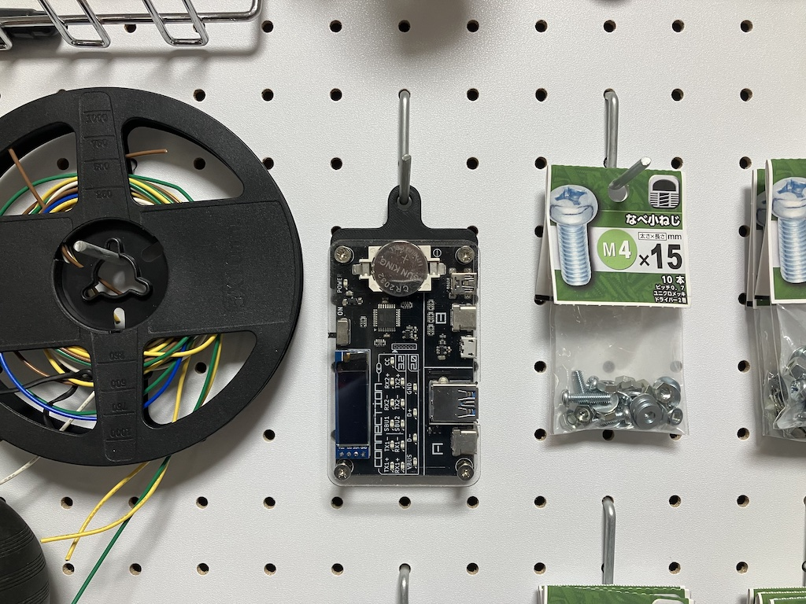
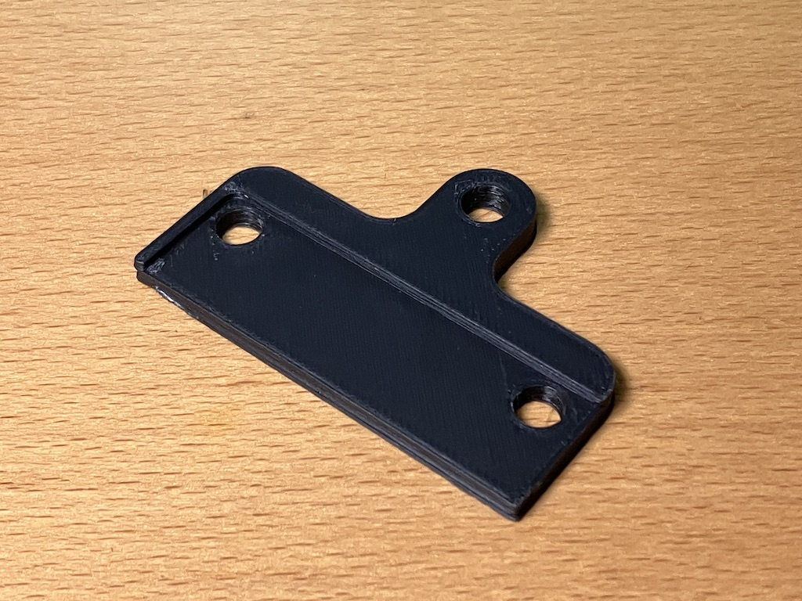

# Hock-mod-for-USB-CABLE-CHECKER-2

## Overview
これは、 [USB CABLE CHECKER2](https://bit-trade-one.co.jp/adusbcim/) に壁にかけるためのフックを追加する改造パーツです。

## 3D Model
パーツの3Dモデルファイル(STL)は以下です。

- [*.stl](*.stl)

## How to buy
3Dプリンタによる出力品は以下で販売しています。

- [秋葉原ラジオデパートShigezone(シゲゾーン)](https://www.shigezone.com/)

## How to assemble
当改造パーツを **USB CABLE CHECKER2** に取り付ける方法は以下を参照してください。

[How to assemble](./doc/how_to_assemble.md)
