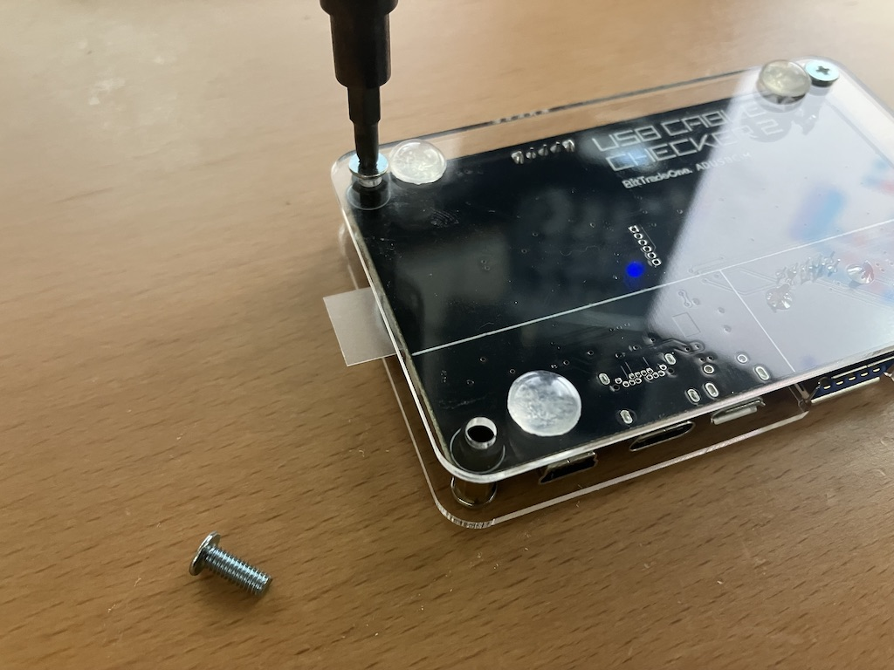
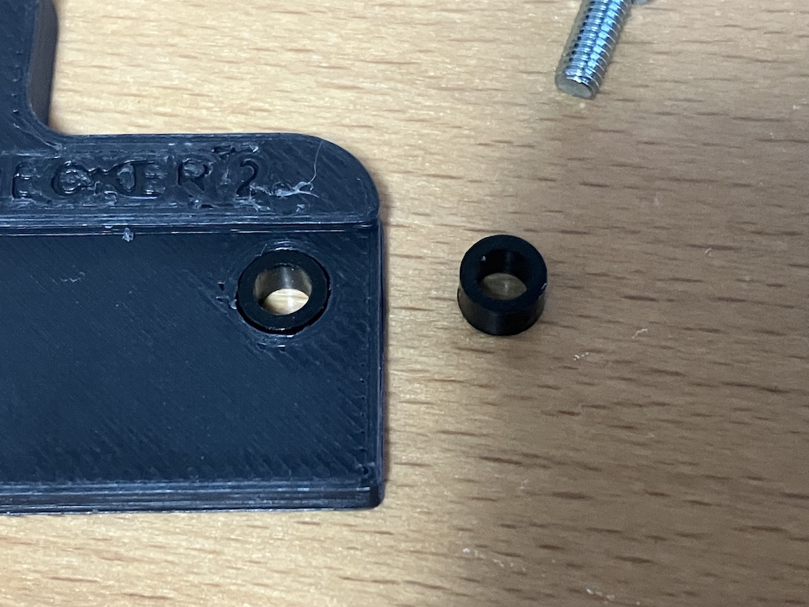
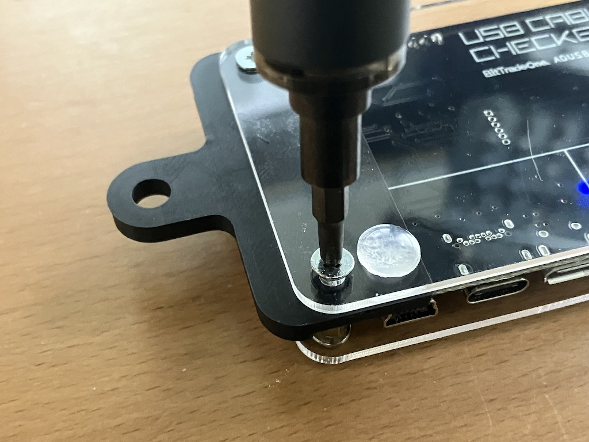
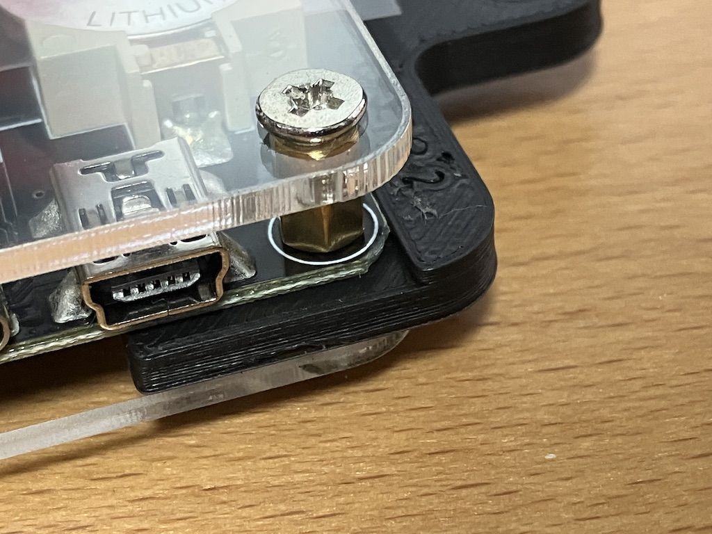
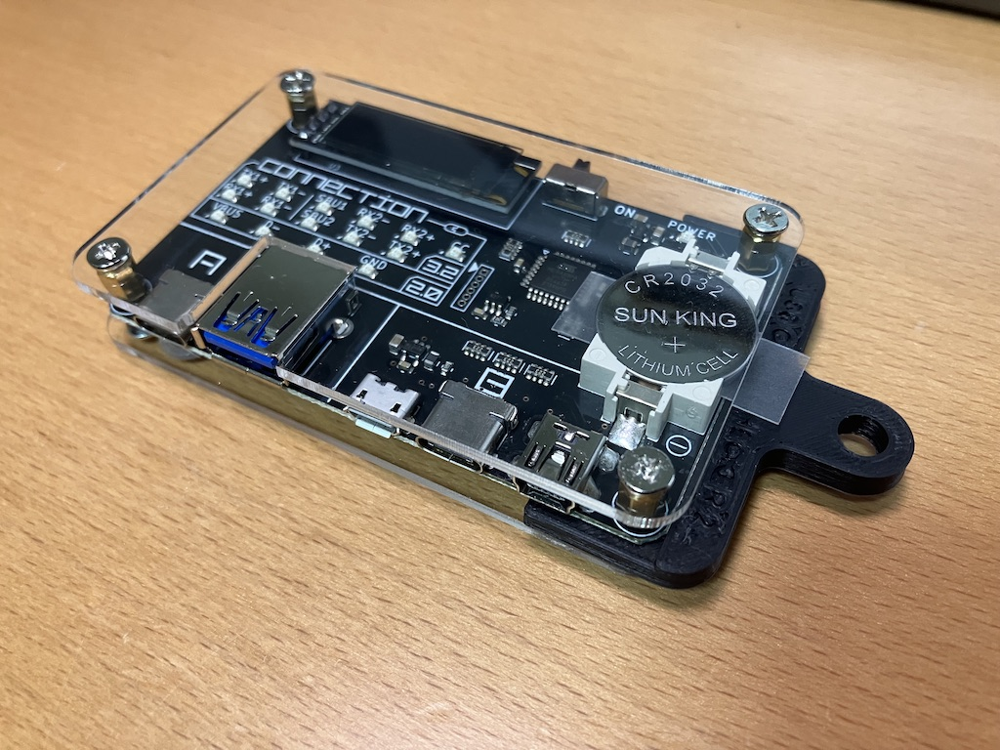

# How to assemble

当改造パーツを **USB CABLE CHECKER2** に取り付ける方法について。

## Procedure

**USB CABLE CHECKER2** の本体裏のネジを外します。  
ボタン電池がある側のみで大丈夫です。  
  

ネジを外した際に外れたスペーサーを当改造パーツの取り付け穴(2ヶ所)にはめ込みます。  
  

はめ込んだスペーサーが外れないよう注意しながら、当改造パーツを **USB CABLE CHECKER2** の下側の隙間に挟み込みます。  
  

取り付け面に段差がある側が **USB CABLE CHECKER2** 本体の表面になるよう注意してください。  
  

ネジを閉め終わったら組み立て完成です。  
  

お疲れ様でした。
